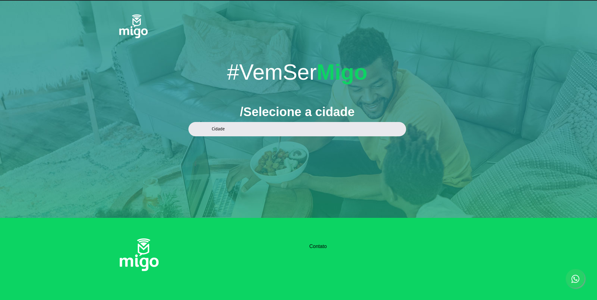
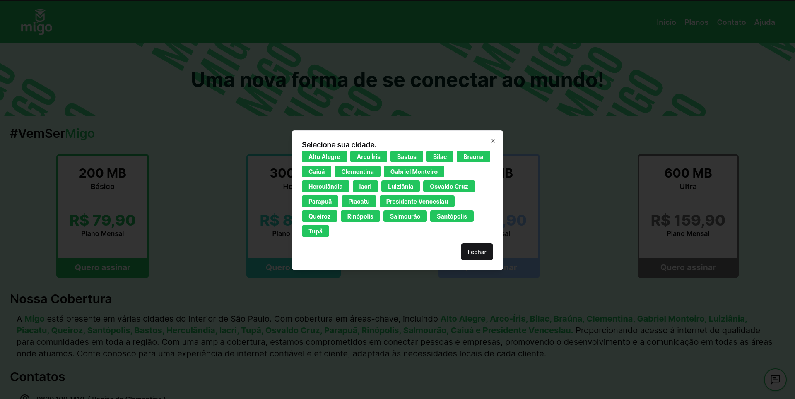
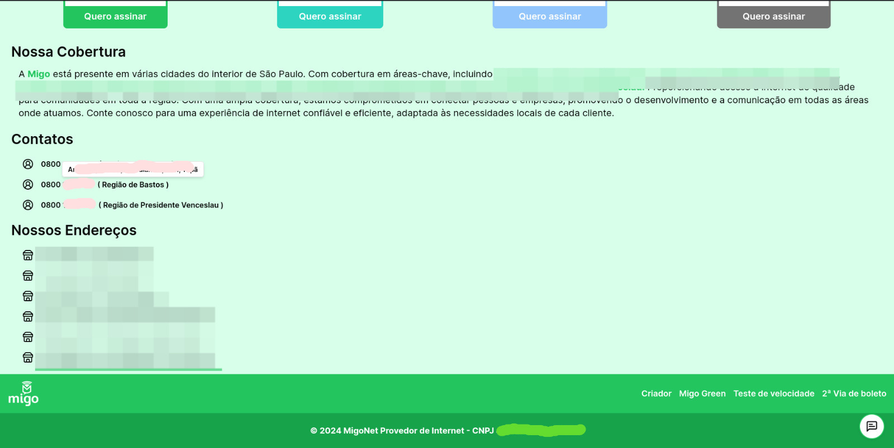
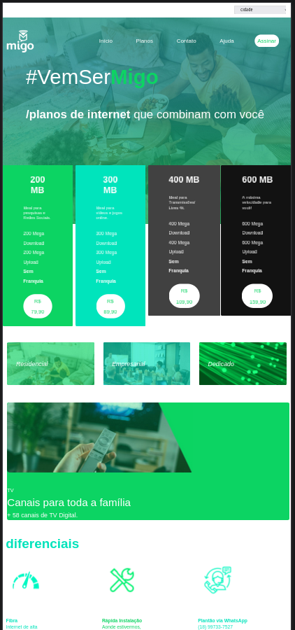
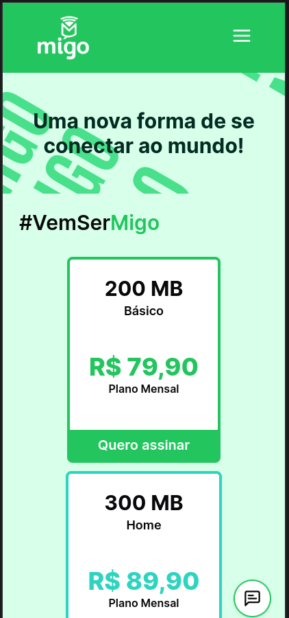

# Landing Page

This is the landing page I created to practice UI/UX. As a basis, I used my city's internet provider, 'Migo Net', and I created a new, unique, and user-friendly design, thus improving the company's online presence.

[Design file (open in Lunacy)](public/migo.free)

After creating the design, I started the work of tabulating all the company's data so that I could apply it later more easily without the need to search page by page.

[Table file (open in your favorite application)](public/migo.ods)

As soon as possible, I started the work of transferring everything to code, which I consider to have been relatively easy because I used [Next.js](https://nextjs.org/), [TypeScript](https://www.typescriptlang.org/), [ShadCN](https://ui.shadcn.com/), [tailwindcss](https://tailwindcss.com/) and [Lucide](https://lucide.dev/).

All the work of writing the code took about a week; it could have been less, but I work and have little time available to program.

# Explaining the website

My version of the website contains only one main page, whereas on their official site, there are several pages because when accessing the page, the user is required to select their city.

**The original version:**

Now you might ask, "since your version doesn't ask for the city, how is this process handled?" I could automatically fetch the location, but in small cities like mine, automatic location collection often doesn't work reliably. Therefore, I chose to ask the user for their location as soon as it's needed, such as when they're signing up for a plan.

I made other data like phone numbers and addresses available to everyone so users can choose what suits them best. In the phone section, I added a tooltip to make it easier for users to select the desired phone number.

Something very important that doesn't exist in the original version of the website is responsiveness, as the mobile version is merely a scaled-down version of the desktop one.

**Original version:**

**My Version**

In general, I have to say that I'm pleased with the project and that I've learned new things. I also hope that you have enjoyed it and feel free to check out the code and make any alterations.

**Thank you for reading up to this point.**

  
  

